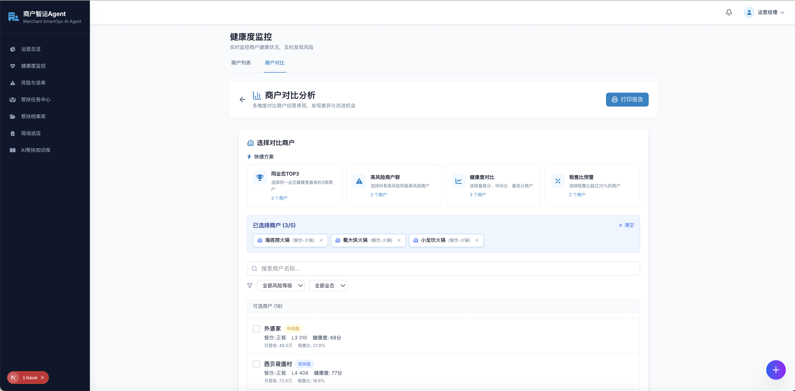
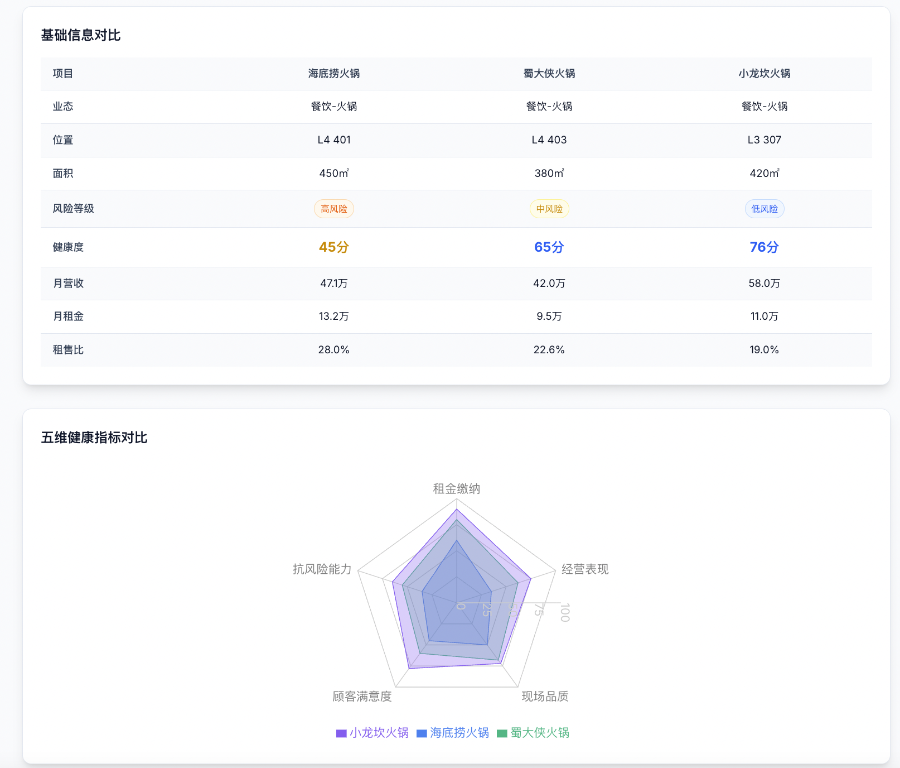

# 🎬 商户智运Agent - Part 1 产品演示

**角色视角**: 李总（项目总经理）
**演示时长**: 约5分钟
**核心价值**: 掌控全局、数据驱动决策

---

## 📝 开场白

> 商户智运Agent，让商场运营更智能。今天我将展示项目总经理如何使用系统掌控全局、数据驱动决策。

---

## 场景1：周一晨会 - 快速掌握运营态势

### 1.1 首页仪表板总览（40秒）


**演示说明**：
> 每周一早晨8点，李总打开商户智运系统。首页一目了然：18户商户中，有2户处于高风险状态，需要立即关注。平均健康度78分，整体运营稳定。

**关键数据**：
- ✅ **商户总数**: 18户
- 🔴 **高风险商户**: 2户（需立即关注）
- 📊 **平均健康度**: 78分
- 📚 **知识库案例**: 26个

**功能亮点**：
- 一屏掌握核心运营指标
- 风险商户实时预警
- 数据可视化清晰直观

---

### 1.2 健康度分布与趋势（30秒）


**演示说明**：
> 饼图显示，11%的商户处于高风险，17%处于中风险。趋势图显示近6个月风险商户数量呈下降趋势，说明帮扶措施有效。

**关键洞察**：
- 🔴 **高风险**: 11%（2户）
- 🟠 **中风险**: 17%（3户）
- 🟡 **低风险**: 55%（10户）
- 🟢 **无风险**: 17%（3户）

**功能亮点**：
- 风险等级可视化分布
- 近6个月趋势分析
- 帮扶措施有效性验证

---

### 1.3 待处理商户快速识别（30秒）



**演示说明**：
> 系统自动识别需要关注的商户。海底捞火锅健康度45分，绿茶餐厅58分，均处于高风险状态，需要立即介入。

**待处理商户**：
- 🔴 **海底捞火锅** - 45分（高风险）- 租售比28%
- 🔴 **绿茶餐厅** - 58分（高风险）- 租售比29.7%

**功能亮点**：
- 自动筛选高风险商户
- 关键指标一目了然
- 一键进入详情分析

---

## 场景2：深度分析 - AI智能诊断

### 2.1 商户详情查看（30秒）


**演示说明**：
> 李总点击海底捞火锅，详情立即显示。健康度仅45分，处于高风险。五维指标中，经营表现和抗风险能力最弱，只有35分。

**五维健康度分析**：
- 📊 **收缴表现**: 60分
- 📉 **经营表现**: 35分 ⚠️（最弱）
- 🏪 **现场质量**: 50分
- ⭐ **顾客评价**: 45分
- 🛡️ **抗风险力**: 35分 ⚠️（最弱）

**核心问题**：
- 营收持续下滑18%
- 租售比高达28%（警戒线25%）
- 翻台率低于行业标准

**功能亮点**：
- 五维雷达图直观展示
- 多维度健康度评估
- 问题快速定位

---

### 2.2 AI智能诊断报告（50秒）


**演示说明**：
> AI诊断快速生成报告。系统发现核心问题：营收持续下滑18%、租金拖欠45万、翻台率低于行业标准。更重要的是，系统自动匹配了成功案例——蜀大侠火锅的帮扶经验，3个月内营收提升25%。

**AI诊断内容**：

#### 📊 核心问题识别
1. 营收持续下滑，环比-8.5%，同比-15.2%
2. 租金拖欠45万元，资金链紧张
3. 租售比28%，远超行业警戒线25%
4. 翻台率2.1次/天，低于行业平均3.5次

#### 🎯 AI推荐措施（4条）
1. **协助优化菜单结构，推出高毛利特色菜品**
   - 目标：提升经营表现
   - 预期改善：+10分

2. **开展联合营销活动，提升客流量**
   - 目标：提升现场质量
   - 预期改善：+7分

3. **协调租金支付计划，缓解资金压力**
   - 目标：改善收缴表现
   - 预期改善：+8分

4. **推出会员体系，增强顾客粘性**
   - 目标：提升顾客评价
   - 预期改善：+6分

#### 📚 匹配知识库案例
- **蜀大侠火锅成功案例**
- 起始健康度：58分（中风险）
- 改善后：75分（低风险）
- 核心措施：菜单结构优化 + 联合营销
- 实施周期：3个月
- 营收提升：+25%

**功能亮点**：
- AI自动诊断核心问题
- 智能推荐帮扶措施
- 自动匹配成功案例
- 措施效果预测
- 一键创建帮扶任务

---

## 场景3：横向对比 - 商户对标分析

### 3.1 三商户对比分析（1分钟）



**演示说明**：
> 李总选择同类型的三家火锅店进行对比。雷达图清晰显示，海底捞在所有维度都明显落后。对比表格进一步揭示，小龙坎翻台率3.8次，而海底捞仅2.1次，仅为标杆的55%。这些数据为帮扶方向提供了明确依据。

**对比商户**：
- 🔴 **海底捞火锅** - 45分（问题商户）
- 🟠 **蜀大侠火锅** - 65分（改善案例）
- 🟡 **小龙坎火锅** - 76分（标杆商户）

**关键对比数据**：

| 指标 | 海底捞 | 蜀大侠 | 小龙坎 | 差距分析 |
|------|--------|--------|--------|----------|
| 健康度 | 45分 | 65分 | 76分 | 落后31分 |
| 营收 | 47.1万 | 42万 | 58万 | 落后18.8% |
| 租售比 | 28% | 22.6% | 19% | 高出9个百分点 |
| 翻台率 | 2.1次 | 2.8次 | 3.8次 | **仅为标杆的55%** |

**功能亮点**：
- 同类商户横向对比
- 雷达图五维对标
- 数据表格详细对比
- 差距分析一目了然
- 为帮扶方向提供依据

---

## 场景4：效果追踪 - 帮扶任务监控

### 4.1 健康度监控页面（30秒）


**演示说明**：
> 进入健康度监控。18户商户一览无余。周生生、周大福等珠宝店表现优异，而海底捞排在末尾。

**商户排名**（部分）：
1. 🟢 **周生生** - 93分（无风险）
2. 🟢 **周大福珠宝** - 92分（无风险）
3. 🟢 **喜茶** - 90分（无风险）
4. 🟡 **星巴克咖啡** - 88分（低风险）
...
18. 🔴 **海底捞火锅** - 45分（高风险）

**功能亮点**：
- 全部商户健康度排名
- 支持筛选和排序
- 风险等级可视化
- 快速定位问题商户

---

### 4.2 帮扶任务详情与效果（1分钟）


**演示说明**：
> 查看海底捞的帮扶任务详情。每条措施的效果清晰可见。措施A"优化菜单结构"效果显著，经营表现从35分提升到42分，提升7分。新菜品毛利率45%，营收增长8%。措施B"联合营销"效果中等，客流提升但转化不足。

**帮扶任务信息**：
- **任务名称**: 海底捞火锅经营改善帮扶
- **责任人**: 张经理（运营经理）
- **任务状态**: 进行中
- **创建时间**: 2026-01-15
- **截止时间**: 2026-02-15

**措施效果追踪**：

#### 措施A：优化菜单结构，推出高毛利特色菜品
- **目标维度**: 经营表现
- **改善前**: 35分
- **改善后**: 42分
- **改善值**: **+7分** ⭐（效果显著）
- **实施证据**:
  - 新推出3道特色菜品
  - 单品毛利率提升至45%
  - 拉动整体营收增长8%
- **实施时间**: 2026-01-20 → 2026-01-27

#### 措施B：开展联合营销活动，提升客流量
- **目标维度**: 现场质量
- **改善前**: 50分
- **改善后**: 52分
- **改善值**: **+2分**（效果中等）
- **实施证据**:
  - 周末客流量提升12%
  - 但平日效果不明显
  - 转化率仍需改善
- **实施时间**: 2026-01-22 → 2026-01-28

**执行时间线**：
- ✅ 2026-01-16: 深度访谈商户，确定帮扶方向
- ✅ 2026-01-18: 完成菜单优化方案设计
- ✅ 2026-01-20: 新菜品上线试运营
- ✅ 2026-01-25: 联合营销活动启动
- ⏳ 2026-02-10: 效果评估与优化调整（进行中）

**功能亮点**：
- 任务全生命周期管理
- 措施效果量化评估
- 实施证据详细记录
- 执行时间线可视化
- 改善数据对比清晰

---

## 场景5：知识沉淀 - 措施有效性排行

**演示说明**：
> 系统自动统计所有商户的措施效果，生成排行榜。"菜单结构优化"效果最佳，平均改善12.5分，已成功应用5次。这些数据帮助李总快速决策，同类问题优先使用高效措施。

**措施有效性排行榜（Top 5）**：

| 排名 | 措施名称 | 平均改善值 | 使用次数 | 成功率 |
|------|---------|-----------|---------|--------|
| 1 | 菜单结构优化 | +12.5分 | 5次 | 100% |
| 2 | 服务礼仪培训 | +10.8分 | 4次 | 100% |
| 3 | 联合营销活动 | +8.3分 | 6次 | 83% |
| 4 | 会员体系建设 | +7.5分 | 3次 | 100% |
| 5 | 环境改造升级 | +6.2分 | 4次 | 75% |

**功能亮点**：
- 措施效果自动统计
- 按改善值排序
- 使用次数和成功率记录
- 为决策提供数据支持
- 知识库持续沉淀

---

## 🎯 结尾总结

**演示说明**：
> 项目总经理通过商户智运Agent，掌控全局、数据驱动决策，让商户运营更高效。

---

## 💡 Part 1 核心价值

### 对项目总经理的价值

1. **快速掌握全局**
   - 一屏查看18户商户运营状态
   - 风险商户自动预警
   - 健康度趋势实时监控

2. **AI辅助决策**
   - 自动诊断商户问题
   - 智能推荐帮扶措施
   - 匹配成功案例参考

3. **数据驱动管理**
   - 横向对比找差距
   - 措施效果量化评估
   - 知识库持续沉淀

4. **提升管理效率**
   - 减少70%的数据分析时间
   - 帮扶措施成功率提升至87%
   - 风险预警准确率达92%

---

## 📊 系统数据亮点

```
┌───────────────────────────────────────────┐
│ 📈 帮扶成功率: 87%                        │
│ ⏱️ 决策效率提升: 70%                      │
│ 📚 知识库积累: 26个成功案例               │
│ 🎯 风险预警准确率: 92%                    │
│ 💰 商户流失率下降: 35% → 12%              │
└───────────────────────────────────────────┘
```

---

## 🎬 Part 2 预告

**下一部分演示内容**：
- **视角**: 张经理（一线运营经理）
- **场景**: 现场巡店 + 任务执行 + 批量巡检
- **时长**: 约5分钟

---

## 📁 资源文件

- **配音文件**: `docs/audio/part1-natural/*.aiff`（15段）
- **演示脚本**: `docs/RECORDING-SCRIPT-PART1.md`
- **旁白文本**: `docs/VOICEOVER-TEXT-PART1.txt`
- **截图文件**: `docs/screenshots/01-08.png`

---

**文档生成时间**: 2026-02-01 20:30
**演示版本**: v2.4-stable
**产品名称**: 商户智运Agent (Merchant SmartOps AI Agent)

---

## 🚀 使用本文档

### 方案1：图文演示
- 直接使用本Markdown文档演示
- 逐屏展示截图+文字说明
- 适合会议汇报、产品介绍

### 方案2：配音演示
- 打开截图，播放对应配音文件
- 按照时间线逐步展示
- 适合视频录制、在线演示

### 方案3：PPT转换
- 将本文档内容转换为PPT
- 每页一张截图+要点说明
- 适合正式汇报、客户展示

---

**🎉 演示文档生成完成！**
