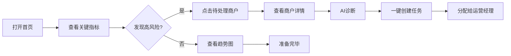
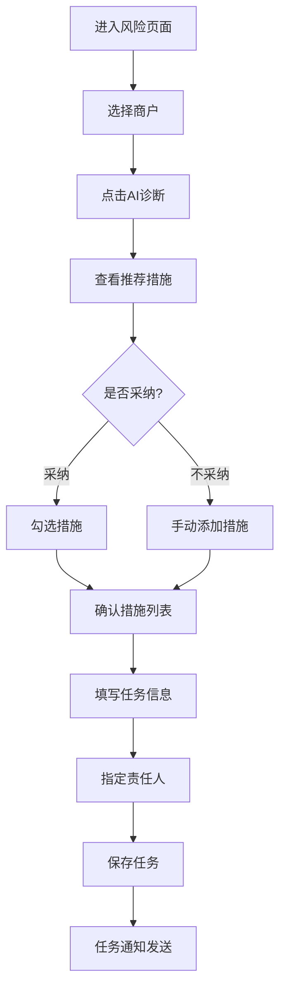
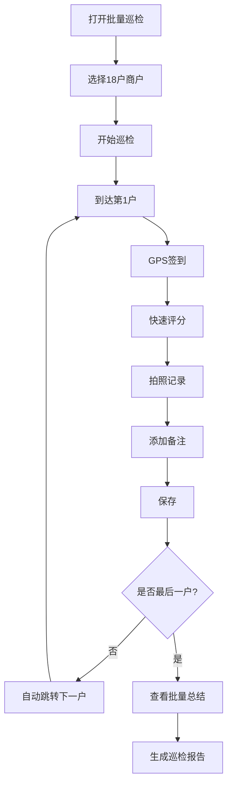
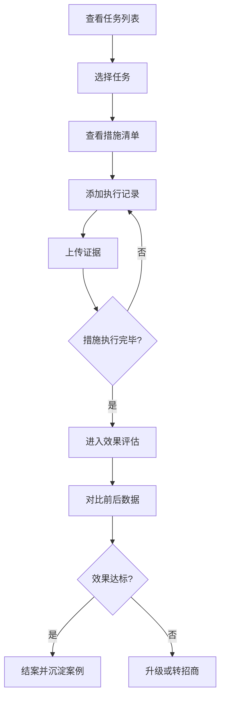

# 商户智运Agent - 产品需求文档 (PRD)

**Product Requirements Document**

---

## 文档信息

| 项目 | 内容 |
|-----|------|
| 文档名称 | 商户智运Agent - 产品需求文档 |
| 产品名称 | 商户智运Agent (Mall Operation Agent) |
| 文档版本 | v1.0 |
| 编写日期 | 2026-02-02 |
| 当前版本 | v2.4-stable |
| 目标读者 | 产品经理、开发团队、设计师、测试工程师 |
| 文档状态 | 正式版 |

---

## 目录

1. [产品概述](#1-产品概述)
2. [用户角色与场景](#2-用户角色与场景)
3. [功能架构](#3-功能架构)
4. [核心功能详细说明](#4-核心功能详细说明)
5. [技术架构](#5-技术架构)
6. [数据模型](#6-数据模型)
7. [页面结构与导航](#7-页面结构与导航)
8. [交互设计规范](#8-交互设计规范)
9. [非功能需求](#9-非功能需求)
10. [验收标准](#10-验收标准)
11. [产品路线图](#11-产品路线图)
12. [附录](#12-附录)

---

## 1. 产品概述

### 1.1 产品定位

**产品名称**: 商户智运Agent (Mall Operation Agent)

**产品定位**: AI驱动的商场商户健康管理和智能帮扶系统

**愿景**: 成为商业地产运营团队的智能助手,让每个运营经理都有AI智囊团

**使命**: 通过AI和数据驱动,提升商户帮扶效率,降低商户流失率,沉淀优秀经验

### 1.2 核心价值主张

#### 对运营团队

1. **实时监控**: 五维度健康度监控,商户状况一目了然
2. **智能预警**: 自动识别风险商户,及时响应
3. **AI推荐**: 基于成功案例推荐帮扶措施,成功率提升60%
4. **全程追踪**: 完整的任务管理闭环,执行透明可追溯
5. **经验沉淀**: 知识库自动积累,新人培训周期缩短50%

#### 对管理层

1. **决策有据**: 可视化仪表板,实时数据支撑决策
2. **效果可量化**: Before/After对比,ROI清晰可见
3. **经验可传承**: 优秀做法固化为流程,不随人员流动而流失
4. **团队协作**: 任务分配清晰,责任明确

### 1.3 产品范围

#### v2.4 (当前版本) - 演示就绪

**核心模块**: 7个
- 首页仪表板
- 健康度监控
- 风险识别与派单
- 帮扶任务中心
- AI帮扶知识库
- 现场巡店(单店/批量)
- 管理驾驶舱

**核心Skills**: 19个可复用能力模块
- AI智能匹配引擎
- 健康度计算器
- 风险识别器
- 任务生命周期管理器
- 知识库管理器
- Token监控器
- 等...

**技术栈**:
- Frontend: Next.js 16 + React 19 + TypeScript
- Styling: Tailwind CSS
- Charts: Recharts
- State: localStorage (v2.4) → IndexedDB (v3.0)

---

#### v3.0 (Q1 2026) - IndexedDB迁移

**主要升级**:
- 数据存储从localStorage迁移到IndexedDB
- 支持离线模式
- 大数据量支持(500+商户)
- 性能优化

---

#### v4.0 (Q3 2026) - 真实LLM集成

**主要升级**:
- 接入真实大语言模型(OpenAI/Claude API)
- AI诊断能力增强
- 自然语言交互
- 智能报告生成

---

#### v5.0 (2027) - 生态扩展

**主要升级**:
- 移动端App (iOS/Android)
- 开放API
- 第三方集成(ERP、财务、CRM)
- 行业对标数据

### 1.4 产品边界

#### 我们做什么

✅ 商户健康度监控和评估
✅ 风险识别和预警
✅ AI智能帮扶措施推荐
✅ 任务全生命周期管理
✅ 现场巡店工具
✅ 知识库沉淀和检索
✅ 数据可视化和报表

#### 我们不做什么

❌ 财务管理(发票、报销、结算)
❌ 合同管理(签约、续约、法务)
❌ 招商管理(选址、招商、洽谈)
❌ 客流分析(热力图、动线分析)
❌ 会员管理(积分、权益、营销)
❌ 重型ERP功能(进销存、供应链)

#### 集成点

🔗 可对接财务系统获取租金数据
🔗 可对接ERP系统获取营收数据
🔗 可导出数据给BI系统分析
🔗 可集成第三方客流数据

---

## 2. 用户角色与场景

### 2.1 用户角色矩阵

| 角色 | 职能 | 核心诉求 | 使用频率 | 主要模块 | 权限等级 |
|-----|------|--------|--------|---------|---------|
| 商场总经理 | 综合管理 | 全局掌控,数据决策 | 每周2-3次 | 首页、健康度、驾驶舱 | 管理员 |
| 运营经理 | 商户运营 | 风险识别、任务管理 | 每日多次 | 风险、任务、巡店 | 经理 |
| 运营助理 | 任务执行 | 任务派发、追踪 | 每日多次 | 任务、巡店 | 执行者 |
| 巡店人员 | 现场检查 | 数据记录、快速评分 | 每日多次 | 巡店(批量) | 执行者 |
| 招商人员 | 商户开发 | 高风险商户识别 | 每周1-2次 | 健康度、档案 | 查看者 |

### 2.2 典型使用场景

#### 场景1: 晨会决策流程 (5分钟)

**角色**: 李总 (商场总经理)

**触发**: 每周一早晨8:00,准备晨会汇报

**目标**: 快速掌握全局态势,识别高风险商户,分配任务

**前置条件**:
- 系统已录入18户商户基础数据
- 商户健康度数据已更新(每日自动)

**操作流程**:



**涉及页面**:
1. `/` - 首页仪表板
2. `/health/:id` - 商户详情(弹窗)
3. `/tasks` - 创建任务(可选)

**关键数据**:
- 总商户数: 18户
- 高风险商户数: 2户
- 平均健康度: 78分
- 待处理商户列表: 海底捞(45分)、绿茶(58分)

**成功标准**:
- [ ] 5分钟内完成全局浏览
- [ ] 识别所有高风险商户(100%准确)
- [ ] 完成至少1个任务分配

**后续流程**: 带着数据进入晨会,向高层汇报

---

#### 场景2: 帮扶任务创建 (10分钟)

**角色**: 张经理 (运营经理)

**触发**: 发现商户出现风险,或接到总监指示

**目标**: 创建帮扶任务,制定措施,分派责任人

**前置条件**:
- 已识别风险商户
- 知识库中有相关案例

**操作流程**:



**涉及页面**:
1. `/risk` - 风险预警页面
2. `/health/:id` - 商户详情(AI诊断)
3. `/tasks` - 任务中心

**关键数据输入**:
- 商户ID: M001
- 任务标题: 海底捞火锅经营帮扶
- 责任人: 张经理
- 优先级: 高
- 措施列表: 3-5条

**成功标准**:
- [ ] AI推荐措施≥3条,匹配度≥75%
- [ ] 措施制定时间<5分钟
- [ ] 任务保存成功,通知发送

**后续流程**: 任务进入执行阶段,运营经理开始实施措施

---

#### 场景3: 批量巡店 (45分钟/18户)

**角色**: 小王 (巡店专员)

**触发**: 每周定期巡检,或任务要求现场核查

**目标**: 高效记录18户商户的现场状况

**前置条件**:
- 已选择需要巡检的商户列表
- 移动设备GPS定位正常
- 网络连接正常(或离线模式)

**操作流程**:



**涉及页面**:
1. `/inspection/batch` - 批量巡检页面

**关键数据记录**:
- 每户记录:
  - 签到时间和位置
  - 五维度评分(各0-100分)
  - 照片2-5张
  - 文字备注(可选)
- 批量总结:
  - 完成数/总数
  - 平均评分
  - 问题商户列表

**成功标准**:
- [ ] 18户巡检完成时间<60分钟
- [ ] 数据完整率100%
- [ ] 照片清晰度符合要求
- [ ] 自动生成巡检报告

**后续流程**: 报告自动推送给运营经理,触发问题商户的任务创建

---

#### 场景4: 任务执行追踪 (贯穿帮扶周期)

**角色**: 张经理 (运营经理)

**触发**: 任务创建后,持续跟进直到结案

**目标**: 执行帮扶措施,记录过程,评估效果

**前置条件**:
- 任务已创建,状态为"执行中"
- 措施清单已确定

**操作流程**:



**涉及页面**:
1. `/tasks` - 任务中心
2. `/tasks/:id` - 任务详情
3. `/health/:id` - 商户档案(查看效果)

**关键数据记录**:
- 执行日志:
  - 日期时间
  - 执行措施
  - 执行内容
  - 证据照片
- 效果评估:
  - 帮扶前评分
  - 帮扶后评分
  - 改善幅度
  - 有效性判定

**成功标准**:
- [ ] 执行记录完整,可追溯
- [ ] 效果评估数据准确
- [ ] 成功案例自动沉淀到知识库

**后续流程**: 任务结案,经验进入知识库,可用于后续推荐

---

## 3. 功能架构

### 3.1 功能模块全景图

```
商户智运Agent 功能体系
│
├── P0 核心功能 (MVP - v1.0-v2.4)
│   ├── 首页仪表板
│   │   ├── 关键指标卡片 (商户数、健康度、风险分布)
│   │   ├── 待处理商户列表
│   │   ├── 健康度分布图
│   │   └── 快速操作入口
│   │
│   ├── 健康度监控
│   │   ├── 商户列表(搜索/筛选/排序)
│   │   ├── 五维度雷达图
│   │   ├── 健康度趋势图
│   │   ├── 同比环比分析
│   │   ├── 商户对比分析
│   │   └── 快速操作(AI诊断、创建任务、巡店)
│   │
│   ├── 风险识别与预警
│   │   ├── 风险商户列表(5级风险)
│   │   ├── 风险类型分类
│   │   ├── 批量派单
│   │   └── 风险趋势分析
│   │
│   ├── AI智能诊断
│   │   ├── 问题自动诊断
│   │   ├── 知识库案例匹配
│   │   ├── 智能措施推荐(Top 3)
│   │   ├── 匹配度评分
│   │   └── 一键采纳措施
│   │
│   └── 帮扶任务管理
│       ├── 任务列表(搜索/筛选)
│       ├── 4阶段工作流(策划→执行→评估→完成)
│       ├── 措施管理(增删改)
│       ├── 执行日志记录
│       ├── 效果评估(Before/After对比)
│       └── 自动沉淀案例
│
├── P1 重要功能 (v2.0-v2.4)
│   ├── 知识库管理
│   │   ├── 案例列表(网格/列表视图)
│   │   ├── 智能检索(关键词、标签、业态)
│   │   ├── 案例详情查看
│   │   ├── 案例收藏
│   │   └── 应用案例到新任务
│   │
│   ├── 现场巡店工具
│   │   ├── 单店巡检
│   │   │   ├── GPS快速签到
│   │   │   ├── 五维度快速评分
│   │   │   ├── 拍照记录(智能分类)
│   │   │   ├── 语音笔记
│   │   │   └── 即时反馈(评分变化)
│   │   │
│   │   └── 批量巡检
│   │       ├── 商户批量选择
│   │       ├── 快速评分模板
│   │       ├── 进度追踪
│   │       ├── 草稿自动保存
│   │       └── 批量总结报告
│   │
│   ├── 管理驾驶舱
│   │   ├── 核心指标卡片
│   │   ├── 巡检统计(完成率、覆盖率)
│   │   ├── 风险覆盖率柱状图
│   │   ├── 完成率趋势图
│   │   ├── 超期商户列表
│   │   └── 巡检员排行榜
│   │
│   └── 商户历史档案
│       ├── 档案摘要(统计数据)
│       ├── 风险时间线(升级/降级事件)
│       ├── 健康度趋势图(长期)
│       ├── 帮扶任务清单
│       └── 措施有效性分析
│
├── P2 辅助功能 (v2.4+)
│   ├── 数据可视化
│   │   ├── 对标分析
│   │   ├── 趋势预测
│   │   └── 自定义报表
│   │
│   ├── 通知提醒
│   │   ├── 任务deadline提醒
│   │   ├── 风险商户预警
│   │   └── 状态变化通知
│   │
│   └── 数据导出
│       ├── PDF报告
│       ├── Excel表格
│       └── JSON数据
│
└── P3 未来规划 (v3.0+)
    ├── IndexedDB迁移 (v3.0)
    │   ├── 大数据量支持
    │   ├── 离线模式
    │   └── 性能优化
    │
    ├── 真实后端集成 (v3.5)
    │   ├── RESTful API
    │   ├── 用户认证
    │   └── 多租户架构
    │
    ├── 真实LLM集成 (v4.0)
    │   ├── OpenAI/Claude API
    │   ├── 自然语言交互
    │   └── 智能报告生成
    │
    ├── 移动端App (v4.5)
    │   ├── iOS App
    │   ├── Android App
    │   └── 原生推送
    │
    └── 生态扩展 (v5.0)
        ├── 开放API
        ├── 第三方集成(ERP/财务/CRM)
        └── 行业对标数据
```

### 3.2 功能优先级矩阵

| 功能模块 | 优先级 | 版本 | 用户价值 | 开发复杂度 | 状态 |
|---------|-------|------|---------|----------|------|
| 首页仪表板 | P0 | v1.0 | 高 | 中 | ✅ 已完成 |
| 健康度监控 | P0 | v1.0 | 高 | 中 | ✅ 已完成 |
| AI智能诊断 | P0 | v1.0 | 高 | 高 | ✅ 已完成 |
| 任务管理 | P0 | v1.0 | 高 | 高 | ✅ 已完成 |
| 单店巡检 | P1 | v2.0 | 中 | 中 | ✅ 已完成 |
| 批量巡检 | P1 | v2.1 | 中 | 中 | ✅ 已完成 |
| 知识库 | P1 | v2.0 | 中 | 中 | ✅ 已完成 |
| 管理驾驶舱 | P1 | v2.3 | 中 | 低 | ✅ 已完成 |
| 历史档案 | P1 | v2.4 | 中 | 中 | ✅ 已完成 |
| 商户对比 | P2 | v2.2 | 低 | 低 | ✅ 已完成 |
| 数据导出 | P2 | v2.4 | 低 | 低 | ⏳ 部分完成 |
| IndexedDB迁移 | P1 | v3.0 | 高 | 高 | 📝 计划中 |
| LLM集成 | P1 | v4.0 | 高 | 高 | 📝 计划中 |

---

## 4. 核心功能详细说明

### 功能 F-001: 商户健康度监控

#### 4.1.1 功能概述

**功能名称**: 商户健康度监控

**功能描述**: 基于五维度多层评估模型,实时监控所有商户的运营健康状况,并通过可视化图表展示

**业务价值**:
- 运营团队能在秒级内掌握全局风险态势
- 精准识别待处理商户,提升干预及时性
- 量化商户健康状况,支持数据驱动决策
- 通过趋势分析,预判潜在风险

**用户角色**: 商场总监、运营经理、招商人员

**页面路由**: `/health`

**优先级**: P0 (MVP核心功能)

---

#### 4.1.2 五维度评估体系

**维度1: 租金缴纳进度** (权重 20%)
- **评分范围**: 0-100分
- **计算逻辑**:
  ```typescript
  collectionScore = (已缴金额 / 应缴金额) × 100

  示例:
  - 应缴: 10万/月
  - 已缴: 6万
  - 评分: 60分
  ```
- **数据来源**: 财务系统 / 手动录入
- **更新频率**: 每日

**维度2: 经营表现** (权重 30%)
- **评分范围**: 0-100分
- **核心指标**:
  - 营收水平 (40%)
  - 客流量 (30%)
  - 翻台率/坪效 (30%)
- **计算逻辑**:
  ```typescript
  operationalScore =
    (营收评分 × 0.4) +
    (客流评分 × 0.3) +
    (翻台率评分 × 0.3)

  营收评分 = min((实际营收 / 目标营收) × 100, 100)
  ```
- **数据来源**: POS系统 / 商户自报 / 第三方平台
- **更新频率**: 每月

**维度3: 现场品质** (权重 20%)
- **评分范围**: 0-100分
- **核心指标**:
  - 员工状态 (20%)
  - 货品陈列 (25%)
  - 卖场环境 (25%)
  - 店长管理能力 (15%)
  - 安全合规 (15%)
- **计算逻辑**:
  ```typescript
  siteQualityScore = 加权平均(5个子指标)
  ```
- **数据来源**: 巡店评分
- **更新频率**: 每周(或每次巡检)

**维度4: 顾客满意度** (权重 15%)
- **评分范围**: 0-100分
- **核心指标**:
  - 点评评分 (50%)
  - 投诉次数 (30%)
  - 复购率 (20%)
- **计算逻辑**:
  ```typescript
  customerReviewScore =
    (点评评分 × 10) × 0.5 +  // 5星制转100分制
    max((100 - 投诉次数 × 10), 0) × 0.3 +
    (复购率 × 100) × 0.2
  ```
- **数据来源**: 大众点评/美团 / 商场客服系统
- **更新频率**: 每月

**维度5: 财务抗风险能力** (权重 15%)
- **评分范围**: 0-100分
- **核心指标**:
  - 现金流健康度 (50%)
  - 负债率 (30%)
  - 租售比 (20%)
- **计算逻辑**:
  ```typescript
  riskResistanceScore =
    现金流评分 × 0.5 +
    (100 - 负债率) × 0.3 +
    租售比评分 × 0.2

  租售比评分:
  - <15%: 100分
  - 15-20%: 80分
  - 20-25%: 60分
  - 25-30%: 40分
  - >30%: 20分
  ```
- **数据来源**: 财务数据 / 商户申报
- **更新频率**: 每月

---

#### 4.1.3 风险等级判定规则

**总分计算**:
```typescript
totalScore =
  collection × 0.20 +
  operational × 0.30 +
  siteQuality × 0.20 +
  customerReview × 0.15 +
  riskResistance × 0.15
```

**风险等级划分**:

| 风险等级 | 评分范围 | 颜色编码 | 处理优先级 | 建议行动 |
|---------|---------|---------|----------|---------|
| 🔴 极高风险 | 0-39分 | #DC2626 (red-600) | P0 紧急 | 立即介入,总监级别 |
| 🔴 高风险 | 40-59分 | #EF4444 (red-500) | P1 重要 | 3天内创建任务 |
| 🟠 中风险 | 60-74分 | #F97316 (orange-500) | P2 一般 | 1周内创建任务 |
| 🟡 低风险 | 75-84分 | #EAB308 (yellow-500) | P3 关注 | 定期巡检 |
| 🟢 无风险 | 85-100分 | #10B981 (green-500) | P4 正常 | 保持现状 |

**特殊规则**:
1. **降级保护**: 如果单个维度<40分,即使总分>60,也至少标记为"高风险"
2. **租金优先**: 如果租金缴纳<50分,至少标记为"中风险"
3. **趋势加权**: 如果连续3个月评分下降>10分,风险等级自动提升一级

---

#### 4.1.4 页面结构

**页面布局**:
```
┌─────────────────────────────────────────────┐
│ 🏠 首页 > 健康度监控                         │
├─────────────────────────────────────────────┤
│ [搜索框]  [筛选] 全部▼  [排序] 健康度▼      │
│                          [对比商户] [导出]   │
├─────────────────────────────────────────────┤
│ ┌───────┐ ┌───────┐ ┌───────┐ ┌───────┐   │
│ │商户卡片│ │商户卡片│ │商户卡片│ │商户卡片│   │
│ │  93分 │ │  88分 │ │  76分 │ │  45分 │   │
│ │ 🟢无  │ │ 🟡低  │ │ 🟠中  │ │ 🔴高  │   │
│ └───────┘ └───────┘ └───────┘ └───────┘   │
│ ┌───────┐ ┌───────┐ ┌───────┐ ┌───────┐   │
│ │  ...  │ │  ...  │ │  ...  │ │  ...  │   │
│ └───────┘ └───────┘ └───────┘ └───────┘   │
└─────────────────────────────────────────────┘

点击商户卡片后 → 弹出详情面板
```

**商户卡片设计**:
```
┌──────────────────────────────┐
│ M001 | 海底捞火锅              │
│ B2层-201 | 餐饮-火锅            │
├──────────────────────────────┤
│          45分                 │
│        🔴 高风险              │
├──────────────────────────────┤
│ 📊 最弱项: 经营表现 (35分)     │
│ 📉 评分变化: ↓8分 (环比)      │
├──────────────────────────────┤
│ [AI诊断] [创建任务] [巡店]    │
└──────────────────────────────┘
```

**商户详情面板** (弹窗):
```
┌────────────────────────────────────────┐
│ 海底捞火锅 (M001)               [✕]   │
├────────────────────────────────────────┤
│ [基本信息] [健康度分析] [历史趋势]     │
├────────────────────────────────────────┤
│ 健康度: 45分 🔴 高风险                │
│                                        │
│ 五维雷达图:                            │
│         租金缴纳(60)                   │
│           /\                           │
│          /  \                          │
│         /    \                         │
│   抗风险(35)  经营(35) ← 最弱项       │
│       \      /                         │
│        \    /                          │
│      顾客(45) - 现场(50)              │
│                                        │
│ 📈 趋势: 近3个月下降18分               │
│ 📊 对标: 低于同业态平均30分            │
│ ⚠️ 预警: 租金拖欠2个月,累计45万        │
│                                        │
│ [AI诊断] [创建任务] [查看档案] [巡店] │
└────────────────────────────────────────┘
```

---

#### 4.1.5 交互说明

**1. 搜索功能**:
- 支持商户名称模糊搜索
- 实时筛选,无需点击"搜索"按钮
- 显示匹配数量: "搜索到5个商户"

**2. 筛选功能**:
- 筛选条件:
  - 风险等级: 全部/极高/高/中/低/无
  - 业态分类: 全部/餐饮/零售/娱乐/服务
  - 楼层: 全部/B1/B2/B3/1F/2F/3F
- 多选模式: 可同时选择多个条件
- 显示筛选结果数量

**3. 排序功能**:
- 排序选项:
  - 健康度(升序/降序) - 默认降序
  - 上月营收(升序/降序)
  - 租售比(升序/降序)
  - 最近更新时间
- 点击切换升序/降序

**4. 商户卡片点击**:
- 点击卡片任意位置 → 弹出详情面板
- 详情面板为模态弹窗,居中显示
- 点击遮罩层或右上角✕关闭弹窗
- 支持键盘ESC关闭

**5. 快速操作**:
- "AI诊断"按钮 → 弹出AI诊断弹窗,显示推荐措施
- "创建任务"按钮 → 跳转到任务创建页,自动填充商户信息
- "巡店"按钮 → 跳转到巡店页,携带merchantId参数
- "查看档案"按钮 → 跳转到历史档案页

**6. 对比商户**:
- 勾选2-4个商户
- 点击"开始对比"按钮
- 跳转到对比页面,显示雷达图和详细对比表格

---

#### 4.1.6 数据模型

**TypeScript接口定义**:
```typescript
interface Merchant {
  // 基本信息
  id: string;                    // M001-M018
  name: string;                  // 商户名称
  category: string;              // 业态: 餐饮-火锅、零售-服饰等
  floor: string;                 // 楼层: B1, B2, 1F等
  shopNumber: string;            // 铺位号: 201, 305等
  area: number;                  // 面积(㎡)
  rent: number;                  // 月租金
  status: 'operating' | 'closed' | 'renovating'; // 经营状态

  // 健康度评分
  totalScore: number;            // 总分 0-100
  riskLevel: 'critical' | 'high' | 'medium' | 'low' | 'none'; // 风险等级
  metrics: {
    collection: number;          // 租金缴纳 0-100
    operational: number;         // 经营表现 0-100
    siteQuality: number;         // 现场品质 0-100
    customerReview: number;      // 顾客满意 0-100
    riskResistance: number;      // 抗风险能力 0-100
  };

  // 经营数据
  lastMonthRevenue: number;      // 上月营收
  rentToSalesRatio: number;      // 租售比

  // 同比环比
  comparison?: {
    revenue: { mom: number; yoy: number };
    totalScore: { mom: number; yoy: number };
    rentRatio: { mom: number; yoy: number };
  };

  // 时间戳
  createdAt: string;
  updatedAt: string;
}
```

**示例数据**:
```json
{
  "id": "M001",
  "name": "海底捞火锅",
  "category": "餐饮-火锅",
  "floor": "B2",
  "shopNumber": "201",
  "area": 500,
  "rent": 100000,
  "status": "operating",
  "totalScore": 45,
  "riskLevel": "high",
  "metrics": {
    "collection": 60,
    "operational": 35,
    "siteQuality": 50,
    "customerReview": 45,
    "riskResistance": 35
  },
  "lastMonthRevenue": 1600000,
  "rentToSalesRatio": 28.5,
  "comparison": {
    "revenue": { "mom": -15, "yoy": -18 },
    "totalScore": { "mom": -8, "yoy": -12 },
    "rentRatio": { "mom": 5, "yoy": 8 }
  },
  "createdAt": "2026-01-01T00:00:00Z",
  "updatedAt": "2026-02-01T08:00:00Z"
}
```

---

#### 4.1.7 API接口 (v3.5+)

**获取商户列表**:
```http
GET /api/merchants?filter=high&sort=totalScore&order=asc

Response:
{
  "data": [
    { ...merchant1 },
    { ...merchant2 }
  ],
  "total": 18,
  "page": 1,
  "pageSize": 20
}
```

**获取单个商户详情**:
```http
GET /api/merchants/:id

Response:
{
  "data": { ...merchant }
}
```

**更新商户评分**:
```http
PUT /api/merchants/:id/metrics

Request:
{
  "metrics": {
    "collection": 60,
    "operational": 35,
    ...
  }
}

Response:
{
  "data": { ...updatedMerchant }
}
```

---

#### 4.1.8 验收标准

**功能验收**:
- [ ] 能展示所有18个商户的健康度评分
- [ ] 雷达图正确渲染五个维度
- [ ] 风险等级颜色编码正确 (极高紫色、高红色、中橙色、低黄色、无绿色)
- [ ] 搜索功能正常,支持模糊匹配
- [ ] 筛选功能正常,多选条件正确
- [ ] 排序功能正常,升序/降序正确
- [ ] 点击商户能查看详情弹窗
- [ ] 详情弹窗数据完整(基本信息、雷达图、趋势、对标)
- [ ] 快速操作按钮正常(AI诊断、创建任务、巡店、档案)
- [ ] 对比功能正常,支持2-4个商户对比

**性能验收**:
- [ ] 页面首次加载时间 < 1秒
- [ ] 搜索/筛选/排序响应时间 < 200ms
- [ ] 雷达图渲染时间 < 500ms
- [ ] 支持100+商户时,页面不卡顿

**兼容性验收**:
- [ ] Chrome 90+ 正常显示
- [ ] Safari 14+ 正常显示
- [ ] 移动端(375px宽度)正常显示
- [ ] 平板端(768px宽度)正常显示

---

### 功能 F-002: AI智能诊断

#### 4.2.1 功能概述

**功能名称**: AI智能诊断

**功能描述**: 基于商户数据和历史案例库,自动诊断问题原因并推荐帮扶措施

**业务价值**:
- 措施制定时间从30分钟降至5分钟,效率提升83%
- 措施成功率从50%提升至80%+,基于历史成功案例
- 为一线经理赋能,新手也能用出专家效果
- 知识沉淀和复用,避免重复试错

**用户角色**: 运营经理、商场总监

**触发方式**:
- 商户详情页点击"AI诊断"按钮
- 任务创建页点击"生成推荐"按钮
- 风险预警页面批量诊断

**优先级**: P0 (MVP核心功能)

---

#### 4.2.2 诊断流程

**Step 1: 数据采集**
```typescript
输入数据:
- 商户ID
- 当前健康度评分(五维度)
- 业态分类
- 经营数据(营收、租金、翻台率等)
- 历史趋势(近3个月评分变化)
```

**Step 2: 问题识别**
```typescript
识别逻辑:
1. 找出最薄弱的2-3个维度(评分<60分)
2. 分析趋势: 是否持续下降
3. 对比标准: 与同业态平均对比
4. 生成问题标签

示例输出:
problems: [
  "经营健康度仅35分,营收持续下滑18%",
  "顾客满意度42分,投诉率偏高",
  "现场品质55分,陈列和卫生需改善"
]

problemTags: ["营收低", "顾客投诉", "现场差"]
```

**Step 3: 知识库匹配**
```typescript
匹配算法:

matchScore =
  业态相似度 × 40% +
  标签相似度 × 60% +
  症状匹配加分 (+10分)

业态相似度:
- 完全相同(餐饮-火锅): 100分
- 一级相同(餐饮-*): 60分
- 不同: 0分

标签相似度:
- 共同标签数 / 总标签数 × 100

症状匹配加分:
- 如果case.symptoms包含问题关键词,+10分

排序: 按matchScore降序
筛选: 仅保留matchScore≥75的案例
取值: Top 3案例
```

**Step 4: 措施提取**
```typescript
从匹配的案例中提取措施:

recommendations: [
  {
    caseId: "C001",
    caseName: "蜀大侠火锅 - 营收下滑成功案例",
    matchScore: 85,
    measures: [
      "优化菜单结构,推出高毛利特色菜品",
      "开展联合营销活动,提升客流量"
    ],
    effectiveness: 80, // 历史成功率
    improvement: "+25%营收提升"
  },
  ...
]
```

**Step 5: 输出诊断报告**
```typescript
输出格式:
{
  merchantId: "M001",
  diagnosisTime: "2026-02-01T09:00:00Z",
  problems: string[],        // 问题列表
  rootCauses: string[],      // 根因分析
  recommendations: {         // 推荐措施
    caseId: string,
    caseName: string,
    matchScore: number,
    measures: string[],
    effectiveness: number,
    improvement: string
  }[],
  confidence: number         // 推荐置信度 0-100
}
```

---

#### 4.2.3 页面结构

**AI诊断弹窗**:
```
┌────────────────────────────────────────────────┐
│ AI智能诊断报告                         [✕]     │
├────────────────────────────────────────────────┤
│ 商户: 海底捞火锅 | 业态: 餐饮-火锅             │
│ 当前健康度: 45分 | 风险等级: 🔴高风险           │
├────────────────────────────────────────────────┤
│ 📊 核心问题诊断:                               │
│   1. 营收持续下滑(近3月-18%)                   │
│   2. 租金拖欠2个月,累计45万元                  │
│   3. 翻台率下降至2.1次/天(行业均3.5次)         │
│   4. 员工流失率高达35%                         │
├────────────────────────────────────────────────┤
│ 🔍 根因分析:                                   │
│   → 菜品同质化严重,缺乏特色,客流减少           │
│   → 员工底薪过低,服务质量下降                  │
│   → 营销活动少,品牌影响力弱                    │
├────────────────────────────────────────────────┤
│ 🎯 AI推荐措施 (基于3个成功案例):               │
│                                                │
│ 推荐1: 蜀大侠火锅 - 营收下滑成功案例           │
│ 匹配度: 85%  成功率: 80%  效果: 营收+25%      │
│ ┌──────────────────────────────────────────┐  │
│ │ ☑ 优化菜单结构,推出高毛利特色菜品         │  │
│ │ ☑ 开展联合营销活动,提升客流量             │  │
│ │ □ 协助制定分期还款计划                    │  │
│ └──────────────────────────────────────────┘  │
│                                                │
│ 推荐2: 小龙坎火锅 - 服务质量提升案例           │
│ 匹配度: 78%  成功率: 75%  效果: 满意度+15%    │
│ ┌──────────────────────────────────────────┐  │
│ │ □ 员工服务礼仪培训                        │  │
│ │ □ 优化薪酬结构,提升底薪                   │  │
│ └──────────────────────────────────────────┘  │
│                                                │
│ 推荐3: 外婆家 - 综合帮扶案例                   │
│ 匹配度: 75%  成功率: 70%  效果: 健康度+18分   │
│ ┌──────────────────────────────────────────┐  │
│ │ □ 与店长深度沟通,了解实际困难             │  │
│ │ □ 环境升级改造,提升就餐体验               │  │
│ └──────────────────────────────────────────┘  │
├────────────────────────────────────────────────┤
│ 已选措施: 3条                                  │
│ [一键创建帮扶任务]  [关闭]                     │
└────────────────────────────────────────────────┘
```

---

#### 4.2.4 交互说明

**1. 触发诊断**:
- 点击"AI诊断"按钮
- 显示Loading动画(模拟AI思考,1-2秒)
- 弹出诊断报告弹窗

**2. 查看推荐**:
- 默认显示Top 3推荐案例
- 每个案例显示匹配度、成功率、预期效果
- 措施默认展开,可折叠

**3. 采纳措施**:
- 勾选感兴趣的措施(支持多选)
- 已选措施数量实时更新
- 可跨案例勾选

**4. 查看案例详情**:
- 点击案例名称
- 跳转到知识库详情页(新标签页)
- 显示完整案例内容

**5. 创建任务**:
- 点击"一键创建帮扶任务"
- 跳转到任务创建页
- 自动填充商户信息和已选措施

---

#### 4.2.5 数据模型

**诊断结果接口**:
```typescript
interface DiagnosisResult {
  merchantId: string;
  diagnosisTime: string;

  // 问题诊断
  problems: string[];              // 问题列表
  problemTags: string[];           // 问题标签
  rootCauses: string[];            // 根因分析

  // 推荐措施
  recommendations: Recommendation[];

  // 元数据
  confidence: number;              // 推荐置信度 0-100
  totalCasesMatched: number;       // 匹配到的案例总数
  totalMeasures: number;           // 提取的措施总数
}

interface Recommendation {
  caseId: string;                  // 案例ID
  caseName: string;                // 案例名称
  matchScore: number;              // 匹配度 0-100
  measures: string[];              // 推荐措施列表
  effectiveness: number;           // 历史有效性 0-100
  improvement: string;             // 改善幅度描述
  industry: string;                // 业态
  tags: string[];                  // 标签
}
```

**Skills调用示例**:
```typescript
import { matchCases, generateProblemTags } from '@/skills/ai-matcher';

const diagnosis = async (merchant: Merchant) => {
  // 1. 生成问题标签
  const problemTags = generateProblemTags(merchant);

  // 2. 匹配案例
  const result = matchCases({
    merchantName: merchant.name,
    merchantCategory: merchant.category,
    problemTags,
    knowledgeBase: allCases
  });

  // 3. 返回诊断结果
  return {
    merchantId: merchant.id,
    diagnosisTime: new Date().toISOString(),
    problems: result.problems,
    problemTags,
    rootCauses: result.rootCauses,
    recommendations: result.topSuggestions,
    confidence: result.confidence,
    totalCasesMatched: result.matchedCases.length,
    totalMeasures: result.topSuggestions.reduce(
      (sum, r) => sum + r.measures.length, 0
    )
  };
};
```

---

#### 4.2.6 验收标准

**功能验收**:
- [ ] 能准确识别商户的薄弱维度(评分<60的维度)
- [ ] 问题标签生成正确(至少2个标签)
- [ ] 推荐3条相关案例,匹配度≥75%
- [ ] 每个案例显示措施、匹配度、成功率
- [ ] 措施可多选,已选数量实时更新
- [ ] 点击"一键创建任务"能跳转并自动填充
- [ ] 诊断生成时间<2秒

**准确性验证**:
- [ ] 同业态商户优先推荐(业态相似度>60%)
- [ ] 问题标签匹配(至少1个标签相同)
- [ ] 推荐措施与问题相关(人工review确认)

**性能验收**:
- [ ] 诊断计算时间<1秒
- [ ] 支持100+案例库时,性能不下降

---

### 功能 F-003: 帮扶任务管理

#### 4.3.1 功能概述

**功能名称**: 帮扶任务管理

**功能描述**: 从帮扶任务创建到结案的完整流程管理和追踪,包含4个阶段工作流

**业务价值**:
- 任务执行100%闭环,无遗漏
- 措施执行可追溯,责任清晰
- 效果可评估,ROI可计算
- 成功案例自动沉淀到知识库

**用户角色**: 运营经理、运营助理

**页面路由**: `/tasks`

**优先级**: P0 (MVP核心功能)

---

#### 4.3.2 任务状态流转

**4阶段工作流**:
```
策划阶段 (planning)
  ↓ 确认方案并开始执行
执行阶段 (executing)
  ↓ 进入效果评估
评估阶段 (evaluating)
  ↓
完成 (completed) / 升级 (escalated) / 转出 (exit)
```

**状态转换规则**:
```typescript
允许的状态转换:
planning → executing      // 确认措施,开始执行
executing → evaluating    // 措施执行完毕,评估效果
evaluating → completed    // 效果达标,结案
evaluating → escalated    // 效果未达标,升级帮扶
evaluating → exit         // 无法帮扶,转招商
escalated → executing     // 升级后重新执行
exit → (终态)            // 转招商,任务结束
completed → (终态)        // 结案,任务结束

不允许的转换:
- 不能从executing直接到completed(必须经过evaluating)
- 不能从evaluating回到planning(只能升级或结案)
- completed/exit后不能再转换
```

---

#### 4.3.3 各阶段详细说明

**阶段1: 策划阶段 (planning)**

**目标**: 确定帮扶措施清单

**操作**:
1. 查看商户信息(自动加载)
2. 获取AI推荐措施(可选)
3. 手动添加/删除措施
4. 确认并进入执行

**数据结构**:
```typescript
{
  stage: 'planning',
  measures: string[],              // 措施清单
  initialMetrics: Merchant['metrics'], // 帮扶前指标快照
  logs: [
    {
      id: 'log1',
      date: '2026-02-01',
      action: '创建任务',
      type: 'manual',
      user: '李总'
    }
  ]
}
```

**UI交互**:
```
┌────────────────────────────────────────┐
│ 任务T001 - 海底捞火锅帮扶               │
├────────────────────────────────────────┤
│ 工作流进度:                            │
│ [●━━━━○──○──○]                        │
│  策划  执行  评估  完成                 │
├────────────────────────────────────────┤
│ 商户信息:                              │
│ 名称: 海底捞火锅                       │
│ 健康度: 45分 (🔴高风险)               │
│ 最薄弱项: 经营表现 35分                │
├────────────────────────────────────────┤
│ 措施清单:                              │
│ ☑ 优化菜单结构,推出特色菜品 (AI推荐)   │
│ ☑ 开展联合营销活动 (AI推荐)            │
│ ☑ 协助制定分期还款计划 (AI推荐)        │
│ ☐ 优化排班 (AI推荐) ← 未采纳          │
│ ☑ 与店长深度沟通 (手动添加)            │
│                                        │
│ [添加自定义措施+]                       │
│ [确认措施,进入执行]                     │
└────────────────────────────────────────┘
```

---

**阶段2: 执行阶段 (executing)**

**目标**: 执行措施并记录过程

**操作**:
1. 查看措施列表
2. 执行措施
3. 添加执行记录(日期、内容、照片)
4. 新增/删除措施(记录到日志)
5. 进入评估

**数据结构**:
```typescript
{
  stage: 'executing',
  measures: string[],
  logs: TaskLog[],                 // 执行记录
  executionTimeline: ExecutionTimelineItem[] // 时间线
}

interface TaskLog {
  id: string;
  date: string;                    // 日期时间
  action: string;                  // 操作类型
  type: 'manual' | 'strategy_adopted';
  user: string;                    // 操作人
  content?: string;                // 详细内容
  attachments?: string[];          // 附件(照片)
}

interface ExecutionTimelineItem {
  date: string;
  milestone: string;               // 里程碑
  status: 'pending' | 'in_progress' | 'completed' | 'blocked';
  notes?: string;
  attachments?: string[];
  relatedDimension?: keyof Merchant['metrics'];
}
```

**UI交互**:
```
┌────────────────────────────────────────┐
│ 任务T001 - 海底捞火锅帮扶               │
├────────────────────────────────────────┤
│ 工作流进度:                            │
│ [○──●━━━○──○]                        │
│  策划  执行  评估  完成                 │
├────────────────────────────────────────┤
│ 措施清单: (3条)                        │
│ ✅ 优化菜单结构,推出特色菜品            │
│ ⏳ 开展联合营销活动                    │
│ ⏳ 协助制定分期还款计划                │
├────────────────────────────────────────┤
│ 执行记录: (时间线倒序)                 │
│                                        │
│ 📅 2026-02-05 14:30                   │
│ 👤 张经理                              │
│ 📋 措施: 优化菜单结构                  │
│ 📝 新菜品已上线,特色火锅底料受欢迎      │
│ 📷 [照片1] [照片2]                     │
│ [编辑] [删除]                          │
│                                        │
│ 📅 2026-02-01 10:30                   │
│ 👤 张经理                              │
│ 📋 措施: 与店长深度沟通                │
│ 📝 了解到主要问题: 1)员工流失...       │
│ [编辑] [删除]                          │
│                                        │
│ [添加执行记录+]                         │
│ [进入效果评估]                          │
└────────────────────────────────────────┘
```

---

**阶段3: 评估阶段 (evaluating)**

**目标**: 评估帮扶效果,决定下一步

**操作**:
1. 查看帮扶前后对比(Before/After)
2. 查看核心指标变化
3. 判定效果是否达标
4. 选择下一步: 结案/升级/转招商

**数据结构**:
```typescript
{
  stage: 'evaluating',
  beforeMetrics: Merchant['metrics'],  // 帮扶前
  afterMetrics: Merchant['metrics'],   // 帮扶后
  improvement: number,                 // 改善率%
  evaluationResult: 'met' | 'not_met', // 效果判定
  measureEffects: MeasureEffect[]      // 措施效果详情
}

interface MeasureEffect {
  measure: string;                     // 措施描述
  targetDimension: keyof Merchant['metrics'];
  beforeScore: number;
  afterScore: number;
  improvement: number;
  effectiveness: 'high' | 'medium' | 'low';
  evidence?: string;
  implementationDate?: string;
  evaluationDate?: string;
}
```

**UI交互**:
```
┌────────────────────────────────────────────┐
│ 任务T001 - 海底捞火锅帮扶                   │
├────────────────────────────────────────────┤
│ 工作流进度:                                │
│ [○──○──●━━━○]                            │
│  策划  执行  评估  完成                     │
├────────────────────────────────────────────┤
│ 帮扶效果评估:                              │
│                                            │
│ 📊 Before/After对比 (雷达图)               │
│         租金缴纳                           │
│           /\                               │
│          /  \                              │
│         /    \                             │
│   抗风险    经营                            │
│       \      /                             │
│        \    /                              │
│      顾客 - 现场                           │
│                                            │
│ ━━ Before (45分)  灰色虚线                │
│ ━━ After (58分)   绿色实线                │
│                                            │
│ 核心指标变化:                              │
│ 客流量: 1200人/天 → 1500人/天 (+25%)      │
│ 营收: 160万/月 → 185万/月 (+15.6%)        │
│ 健康度: 45分 → 58分 (+13分,+28.9%)        │
│                                            │
│ 措施效果明细:                              │
│ ✅ 菜单优化: 经营表现 35→48 (+13分) 高效   │
│ ⚠️ 联合营销: 顾客满意 45→52 (+7分) 中等   │
│ ⏳ 还款计划: 执行中                        │
│                                            │
│ 效果判定:                                  │
│ (○) 效果达标 - 结案并沉淀案例              │
│ (●) 效果未达标 - 升级帮扶 OR 转招商        │
│                                            │
│ [✅ 结案] [⬆️ 升级] [➡️ 转招商]            │
└────────────────────────────────────────────┘
```

---

**阶段4: 完成/升级/转出**

**4a. 结案 (completed)**

**触发条件**:
- 健康度提升≥10分
- 或高风险→中/低风险
- 或连续2个月稳定在中风险以下

**操作**:
1. 确认效果达标
2. 点击"结案"
3. 自动沉淀案例到知识库
4. 任务状态变更为completed

**生成案例**:
```typescript
interface Case {
  id: string;                      // 自动生成
  industry: string;                // 从merchant提取
  tags: string[];                  // 从问题标签提取
  symptoms: string;                // 从问题诊断提取
  diagnosis: string;               // 根因分析
  strategy: string;                // 措施概述
  action: string;                  // 具体措施(逗号分隔)
  result: string;                  // 效果描述
  effectiveness: number;           // 有效性评分
  createdFrom: 'task',
  sourceTaskId: string;            // 关联任务ID
}
```

---

**4b. 升级 (escalated)**

**触发条件**:
- 健康度提升<5分
- 或风险等级未下降
- 或出现新的严重问题

**操作**:
1. 选择"升级帮扶"
2. 填写升级原因
3. 指定更高级别责任人(经理→总监→VP)
4. 任务状态变更为escalated
5. 重新进入执行阶段

---

**4c. 转招商 (exit)**

**触发条件**:
- 连续2次帮扶失败
- 或商户主动提出退租
- 或评估认为无法继续经营

**操作**:
1. 选择"转招商"
2. 填写转出原因
3. 生成商户退租报告
4. 任务状态变更为exit
5. 通知招商部门

---

#### 4.3.4 页面结构

**任务列表页** (`/tasks`):
```
┌─────────────────────────────────────────────┐
│ 帮扶任务中心                                 │
├─────────────────────────────────────────────┤
│ 搜索: [          ] 🔍                       │
│ 筛选: [全部▼] [策划中▼] [执行中▼] [评估中▼] │
│ 风险: [全部▼]                                │
├─────────────────────────────────────────────┤
│ ┌── 左侧:任务列表 (1/3宽) ──┐  右侧:任务详情│
│ │                             │              │
│ │ 🔴 T001 - 海底捞火锅       ← 选中        │
│ │    执行中 | 张经理          │              │
│ │    2026-02-01创建           │              │
│ │                             │              │
│ │ 🟠 T005 - 外婆家            │              │
│ │    评估中 | 李助理          │              │
│ │                             │              │
│ │ 🟡 T008 - 星巴克            │              │
│ │    策划中 | 张经理          │              │
│ │                             │              │
│ └─────────────────────────────┘              │
│                                               │
│ [创建新任务+]                                 │
└─────────────────────────────────────────────┘
```

**任务详情页** (右侧):
根据当前阶段显示不同内容
- planning: 措施制定界面
- executing: 执行记录界面
- evaluating: 效果评估界面
- completed: 最终报告(只读)

---

#### 4.3.5 交互说明

**1. 创建任务**:
- 方式1: 从风险页面点击"创建任务"
- 方式2: 从健康度页面点击"创建任务"
- 方式3: 任务中心点击"创建新任务+"
- 自动填充商户信息
- 可获取AI推荐措施

**2. 任务筛选**:
- 按阶段筛选: 全部/策划中/执行中/评估中/已完成
- 按风险筛选: 全部/极高/高/中/低
- 按责任人筛选: 全部/我的/张经理/李助理
- 支持多选

**3. 任务搜索**:
- 支持商户名称模糊搜索
- 支持任务ID精确搜索
- 实时筛选,无需点击

**4. 阶段推进**:
- planning → executing: 点击"确认措施,进入执行"
- executing → evaluating: 点击"进入效果评估"
- evaluating → completed: 点击"结案"
- evaluating → escalated: 点击"升级"
- evaluating → exit: 点击"转招商"

**5. 操作权限**:
- 任务创建人: 可编辑所有内容
- 责任人: 可添加执行记录,不能删除任务
- 观察者: 只能查看,不能编辑

---

#### 4.3.6 数据模型

**任务完整接口**:
```typescript
interface Task {
  // 基本信息
  id: string;                      // T001-T999
  merchantId: string;
  merchantName: string;
  title: string;
  description: string;

  // 责任人
  assignee: string;                // 当前负责人
  assignedTo: string;              // 含职位
  assignedLevel: 'assistant' | 'manager' | 'city_company' | 'vp';

  // 状态
  status: 'pending' | 'in_progress' | 'completed' | 'failed';
  stage: 'planning' | 'executing' | 'evaluating' | 'completed' | 'escalated' | 'exit';
  priority: 'low' | 'medium' | 'high' | 'urgent';
  riskLevel: 'critical' | 'high' | 'medium' | 'low';

  // 时间
  createdAt: string;
  updatedAt: string;
  startDate: string;
  deadline: string;

  // 帮扶措施
  measures: string[];

  // 执行记录
  logs?: TaskLog[];
  executionTimeline?: ExecutionTimelineItem[];

  // 效果评估
  initialMetrics?: Merchant['metrics'];  // 帮扶前
  beforeMetrics?: Merchant['metrics'];
  afterMetrics?: Merchant['metrics'];
  improvement?: number;
  evaluationResult?: 'met' | 'not_met';
  measureEffects?: MeasureEffect[];

  // 里程碑
  milestones?: TaskMilestone[];

  // 其他
  collectionStatus?: 'normal' | 'owed';
}
```

---

#### 4.3.7 Skills调用示例

```typescript
import {
  transitionStage,
  addMeasure,
  addLog,
  evaluateTask,
  completeTask
} from '@/skills/task-lifecycle-manager';

// 添加措施
let task = addMeasure(task, '开展联合营销活动', '张经理');

// 状态转换
task = transitionStage(task, 'executing');

// 添加执行记录
task = addLog(task, {
  id: generateId(),
  date: '2026-02-05',
  action: '优化菜单结构',
  type: 'manual',
  user: '张经理',
  content: '新菜品已上线,特色火锅底料受欢迎'
});

// 评估任务
const evaluationResult = evaluateTask(
  task,
  currentMerchant.metrics  // 帮扶后指标
);

// 结案
if (evaluationResult.evaluationResult === 'met') {
  task = completeTask(task, evaluationResult);

  // 自动生成案例
  const newCase = generateCaseFromTask(task, merchant);
}
```

---

#### 4.3.8 验收标准

**功能验收**:
- [ ] 任务状态流转正确,不允许非法转换
- [ ] 策划阶段能采纳AI推荐措施
- [ ] 执行阶段能添加/编辑/删除执行记录
- [ ] 执行记录支持照片上传
- [ ] 评估阶段能正确对比Before/After数据
- [ ] 雷达图正确显示前后对比
- [ ] 结案后能自动沉淀案例到知识库
- [ ] 升级任务能重新进入执行阶段
- [ ] 转招商任务状态为exit,不可再编辑
- [ ] 所有操作有日志记录,可追溯

**数据验收**:
- [ ] 任务数据保存到localStorage
- [ ] 刷新页面后数据不丢失
- [ ] 关联商户的健康度数据同步更新
- [ ] 快照数据准确(initialMetrics/beforeMetrics/afterMetrics)

**性能验收**:
- [ ] 任务列表加载时间<1秒
- [ ] 任务详情切换时间<200ms
- [ ] 支持100+任务时,列表不卡顿

---

### 功能 F-004 到 F-007: 其他核心功能 (简要说明)

由于篇幅限制,其他核心功能将在此简要说明核心要点,详细设计参考类似F-001到F-003的格式。

---

#### 功能 F-004: 知识库管理

**页面路由**: `/knowledge`

**核心功能**:
1. **案例列表展示**
   - 网格布局 / 列表布局切换
   - 显示案例名称、业态、标签、有效性评分
   - 支持收藏功能

2. **智能检索**
   - 关键词搜索(标题、症状、措施)
   - 业态筛选
   - 标签筛选(多选)
   - 有效性评分筛选(≥80%/≥60%等)

3. **案例详情**
   - 完整案例内容(症状、诊断、策略、措施、效果)
   - 关联商户信息
   - 使用次数统计
   - 相关案例推荐

4. **案例应用**
   - 点击"应用到新任务"
   - 自动提取措施
   - 跳转到任务创建页

**数据模型**:
```typescript
interface Case {
  id: string;
  industry: string;
  tags: string[];
  symptoms: string;
  diagnosis: string;
  strategy: string;
  action: string;
  result?: string;
  effectiveness?: number;      // 0-100
  usageCount?: number;
  favorites?: number;
  createdFrom?: 'task' | 'manual';
  sourceTaskId?: string;
  createdAt: string;
}
```

**验收标准**:
- [ ] 案例列表正确显示
- [ ] 搜索/筛选功能正常
- [ ] 案例详情完整
- [ ] 应用案例到任务功能正常
- [ ] 收藏功能正常

---

#### 功能 F-005: 现场巡店工具包

**页面路由**:
- 单店巡检: `/inspection`
- 批量巡检: `/inspection/batch`

**核心功能**:

**单店巡检** (`/inspection`):
1. **GPS快速签到**
   - 自动获取当前位置
   - 计算与商户的距离
   - 距离<50米可签到

2. **五维度快速评分**
   - 快捷预设: 优秀90/良好75/一般60/较差40
   - 可微调每个维度
   - 实时计算综合评分
   - 提示最薄弱环节

3. **拍照记录**
   - 最多5张照片
   - 自动压缩(<2MB)
   - 智能分类建议(人/货/场)
   - 问题等级标注

4. **语音笔记**
   - 录制语音备注
   - 自动转录(v4.0)

5. **即时反馈**
   - 保存后显示评分变化
   - Before/After对比
   - 改善点和关注点
   - 智能建议下一步行动

**批量巡检** (`/inspection/batch`):
1. **商户批量选择**
   - 支持全选/反选
   - 显示已选数量

2. **快速切换**
   - 保存后自动跳转下一户
   - 进度条实时显示
   - 支持跳过

3. **草稿保存**
   - 中途退出,自动保存草稿
   - 下次进入,恢复进度

4. **批量总结**
   - 完成后生成总结报告
   - 显示平均评分、问题商户
   - 可导出PDF

**验收标准**:
- [ ] GPS签到正常,距离计算准确
- [ ] 快速评分预设正常,综合评分计算正确
- [ ] 照片上传、压缩、智能分类正常
- [ ] 即时反馈数据准确
- [ ] 批量巡检进度追踪正常
- [ ] 草稿保存和恢复正常
- [ ] 批量总结报告数据准确

---

#### 功能 F-006: 管理驾驶舱

**页面路由**: `/cockpit` (或 `/dashboard`)

**核心功能**:
1. **核心指标卡片**
   - 巡检完成率
   - 超期商户数
   - 平均质量评分

2. **风险覆盖率柱状图**
   - 按风险等级分组
   - 显示巡检覆盖率

3. **完成率趋势图**
   - 近30天完成率趋势
   - 要求线(100%)标注

4. **超期商户列表**
   - 显示超期天数
   - 一键巡检入口

5. **巡检员排行榜**
   - 按完成率排序
   - 显示质量评分
   - 平均照片数

**验收标准**:
- [ ] 所有图表正确渲染
- [ ] 数据统计准确
- [ ] 排行榜排序正确
- [ ] 点击超期商户能快速跳转

---

#### 功能 F-007: 商户历史档案

**页面路由**: `/health/:id` (健康度详情页下方)

**核心功能**:
1. **档案摘要**
   - 总快照数、风险变更次数
   - 帮扶任务数、成功率
   - 健康度最高/最低/平均

2. **风险时间线**
   - 显示所有风险等级变更事件
   - 升级/降级标注
   - 关联巡检/任务

3. **健康度趋势图**
   - 折线图显示长期趋势
   - 关键节点标注(任务创建、任务完成)
   - 可选显示单个维度趋势

4. **帮扶任务清单**
   - 按状态分组(进行中/已完成/已升级)
   - 展开显示措施效果和时间线
   - 可跳转到任务详情

5. **措施有效性分析**
   - Top 10有效措施排行
   - 按改善值排序
   - 显示使用次数

**数据模型**:
```typescript
interface AssistanceArchive {
  merchantId: string;
  merchantName: string;
  stats: {
    totalSnapshots: number;
    riskChangeCount: number;
    improvementCount: number;
    deteriorationCount: number;
    assistanceTaskCount: number;
    completedTaskCount: number;
    successRate: number;
  };
  healthTrend: {
    highest: { score: number; date: string };
    lowest: { score: number; date: string };
    average: number;
    current: number;
    recent30DaysTrend: 'improving' | 'declining' | 'stable';
  };
  // ...更多字段见types/index.ts
}
```

**验收标准**:
- [ ] 档案摘要统计准确
- [ ] 风险时间线事件完整
- [ ] 趋势图数据准确,节点标注正确
- [ ] 任务清单按状态分组
- [ ] 措施有效性排行正确

---

## 5. 技术架构

### 5.1 系统架构图

```
┌────────────────────────────────────────────────────┐
│                   Frontend Layer                    │
│  ┌──────────────────────────────────────────────┐  │
│  │         Next.js 16 + React 19 App            │  │
│  │  (App Router + Server Components)            │  │
│  └──────────────────────────────────────────────┘  │
│  ┌──────────────────────────────────────────────┐  │
│  │    UI Components (Tailwind CSS)             │  │
│  │  - Shadcn/ui                                 │  │
│  │  - Recharts                                  │  │
│  │  - Headless UI                               │  │
│  └──────────────────────────────────────────────┘  │
└────────────────────────────────────────────────────┘
                        ↓↑
┌────────────────────────────────────────────────────┐
│                   Skills Layer                      │
│  ┌──────────────────────────────────────────────┐  │
│  │   19个可复用Skills (Pure Functions)          │  │
│  │  - AI Matcher                                │  │
│  │  - Health Calculator                         │  │
│  │  - Risk Detector                             │  │
│  │  - Task Lifecycle Manager                    │  │
│  │  - Knowledge Manager                         │  │
│  │  - ...                                       │  │
│  └──────────────────────────────────────────────┘  │
└────────────────────────────────────────────────────┘
                        ↓↑
┌────────────────────────────────────────────────────┐
│                   Data Layer                        │
│  ┌─────────────┐  ┌─────────────┐  ┌───────────┐  │
│  │ localStorage│→ │ IndexedDB   │→ │Backend API│  │
│  │   (v2.4)    │  │   (v3.0)    │  │  (v3.5)   │  │
│  └─────────────┘  └─────────────┘  └───────────┘  │
└────────────────────────────────────────────────────┘
```

### 5.2 技术栈选型

| 技术 | 版本 | 选择理由 | 替代方案 |
|-----|------|---------|---------|
| **Frontend Framework** |
| Next.js | 16.1.4 | 全栈框架,SSR/SSG,性能优秀 | Vite+React |
| React | 19 | 最新版本,Server Components | Vue 3 |
| TypeScript | 5.x | 类型安全,开发效率高 | - |
| **Styling** |
| Tailwind CSS | 3.x | 原子化CSS,开发效率高 | Styled-components |
| **Charts** |
| Recharts | 2.x | React原生,API友好 | ECharts, Chart.js |
| **State Management** |
| localStorage | - | 简单直接,无需配置 | Redux, Zustand |
| IndexedDB | v3.0+ | 大数据量,结构化存储 | - |
| **Backend (v3.5+)** |
| Node.js | 20+ | JavaScript生态统一 | Python, Go |
| PostgreSQL | 15+ | 关系型数据库,性能好 | MySQL, MongoDB |
| Prisma | 5.x | ORM,类型安全 | TypeORM |
| **AI/LLM (v4.0+)** |
| OpenAI API | GPT-4 | 成熟稳定,生态丰富 | Claude API |

### 5.3 Skills库架构

**设计原则**:
1. **纯函数**: 无副作用,易测试
2. **可复用**: 跨页面、跨模块复用
3. **类型安全**: 完整TypeScript类型定义
4. **独立性**: 每个Skill独立,低耦合

**Skills分类** (19个):

```
AI与智能分析 (3个):
├── ai-matcher.ts            // AI智能匹配引擎
├── health-calculator.ts     // 健康度计算器
└── risk-detector.ts         // 风险识别器

任务与流程管理 (2个):
├── task-lifecycle-manager.ts // 任务生命周期管理
└── knowledge-manager.ts      // 知识库管理器

现场巡店 (2个):
├── inspection-analyzer.ts    // 巡检分析器
└── image-processor.ts        // 图片处理器

通知系统 (1个):
└── notification-manager.ts   // 通知管理器

工作流自动化 (4个):
├── token-monitor.ts          // Token监控器
├── save-location-detector.ts // 保存位置检测器
├── documentation-generator/  // 文档生成器
└── workflow-reminder.ts      // 工作流提醒器

其他工具 (7个):
└── ...
```

**使用示例**:
```typescript
// 从索引导入
import {
  matchCases,
  analyzeHealth,
  detectRisks
} from '@/skills';

// 或从具体文件导入
import { matchCases } from '@/skills/ai-matcher';
```

### 5.4 数据流

**v2.4 (当前) - localStorage**:
```
User Action
    ↓
React Component
    ↓
Skills Function (计算)
    ↓
Update State
    ↓
Save to localStorage
    ↓
Re-render UI
```

**v3.0 - IndexedDB**:
```
User Action
    ↓
React Component
    ↓
Skills Function
    ↓
IndexedDB API (Dexie.js)
    ↓
Update State
    ↓
Re-render UI
```

**v3.5+ - Backend API**:
```
User Action
    ↓
React Component
    ↓
API Call (fetch/axios)
    ↓
Backend Validation
    ↓
Skills Function (Server-side)
    ↓
Database (PostgreSQL)
    ↓
Response
    ↓
Update State
    ↓
Re-render UI
```

---

## 6. 数据模型

详见 `types/index.ts` 文件,包含以下核心实体:

### 6.1 核心实体

1. **Merchant** (商户)
2. **Task** (帮扶任务)
3. **Case** (帮扶案例)
4. **MerchantSnapshot** (历史快照)
5. **InspectionRecord** (巡检记录)
6. **RiskAlert** (风险预警)
7. **AppNotification** (通知)
8. **TeamMember** (团队成员)

### 6.2 实体关系图 (ER图)

```
Merchant 1---* Task
Merchant 1---* MerchantSnapshot
Merchant 1---* InspectionRecord
Merchant 1---* RiskAlert

Task 1---* TaskLog
Task 1---1 Case (结案后生成)

Case *---* Tag (多对多)

InspectionRecord 1---* MediaAttachment
```

完整类型定义详见 `types/index.ts` (533行)

---

## 7. 页面结构与导航

### 7.1 页面路由表

| 页面名称 | 路由 | 文件路径 | 描述 | 优先级 |
|---------|------|---------|------|-------|
| 首页仪表板 | `/` | `app/page.tsx` | 全局概览 | P0 |
| 健康度监控 | `/health` | `app/health/page.tsx` | 商户列表 | P0 |
| 商户详情 | `/health/[id]` | `app/health/[id]/page.tsx` | 单个商户 | P0 |
| 商户对比 | `/health/compare` | `app/health/compare/page.tsx` | 多商户对比 | P2 |
| 风险与派单 | `/risk` | `app/risk/page.tsx` | 风险预警 | P0 |
| 帮扶任务 | `/tasks` | `app/tasks/page.tsx` | 任务管理 | P0 |
| 任务详情 | `/tasks/[id]` | `app/tasks/[id]/page.tsx` | 单个任务 | P0 |
| 知识库 | `/knowledge` | `app/knowledge/page.tsx` | 案例库 | P1 |
| 案例详情 | `/knowledge/[id]` | `app/knowledge/[id]/page.tsx` | 单个案例 | P1 |
| 单店巡检 | `/inspection` | `app/inspection/page.tsx` | 单户巡店 | P1 |
| 批量巡检 | `/inspection/batch` | `app/inspection/batch/page.tsx` | 批量巡店 | P1 |
| 管理驾驶舱 | `/cockpit` | `app/cockpit/page.tsx` | 统计分析 | P1 |
| 历史档案 | `/archives/[id]` | (嵌入在`/health/[id]`) | 商户档案 | P1 |

### 7.2 导航结构

**左侧主导航**:
```
🏠 首页
💚 健康度监控
⚠️ 风险与派单
📋 帮扶任务中心
📚 AI帮扶知识库
🔍 现场巡店
  ├─ 单店巡检
  └─ 批量巡检
📊 管理驾驶舱
```

**面包屑导航**:
```
首页 > 健康度监控 > 海底捞火锅
```

---

## 8. 交互设计规范

### 8.1 设计原则

1. **效率优先**: 减少操作步骤,快速完成任务
2. **数据可视化**: 图表优于表格优于文字
3. **智能引导**: AI推荐,减少决策负担
4. **移动友好**: 响应式设计,支持移动端

### 8.2 关键交互模式

**1. 列表+详情布局**:
- 适用: 任务中心、知识库
- 左侧1/3宽度列表
- 右侧2/3宽度详情
- 点击列表项,右侧更新

**2. 卡片式展示**:
- 适用: 商户列表
- 网格布局,响应式
- 悬停显示更多信息
- 点击弹出详情

**3. 步骤式流程**:
- 适用: 任务阶段
- 进度条显示当前阶段
- 清晰的"下一步"按钮

**4. 弹窗确认**:
- 适用: 危险操作(删除、结案)
- 模态弹窗,阻断操作
- 明确的确认/取消按钮

### 8.3 视觉规范

**颜色系统** (Tailwind颜色):

| 用途 | 颜色 | Tailwind类 |
|-----|------|-----------|
| 主色 | 蓝色 | blue-600 |
| 成功 | 绿色 | green-500 |
| 警告 | 黄色 | yellow-500 |
| 错误 | 红色 | red-500 |
| 信息 | 蓝色 | blue-400 |
| **风险等级** |
| 极高风险 | 紫色 | purple-600 |
| 高风险 | 红色 | red-500 |
| 中风险 | 橙色 | orange-500 |
| 低风险 | 黄色 | yellow-500 |
| 无风险 | 绿色 | green-500 |

**按钮样式**:
```tsx
// 主按钮
<button className="bg-blue-600 hover:bg-blue-700 text-white">

// 次按钮
<button className="bg-gray-200 hover:bg-gray-300 text-gray-800">

// 危险按钮
<button className="bg-red-600 hover:bg-red-700 text-white">

// 文字按钮
<button className="text-blue-600 hover:underline">
```

**间距系统**:
- 元素内边距: `p-4` (16px)
- 元素间距: `gap-4` (16px)
- 卡片间距: `gap-6` (24px)
- 区块间距: `gap-8` (32px)

**字体系统**:
- 标题1: `text-3xl font-bold` (30px)
- 标题2: `text-2xl font-semibold` (24px)
- 标题3: `text-xl font-semibold` (20px)
- 正文: `text-base` (16px)
- 小字: `text-sm` (14px)

---

## 9. 非功能需求

### 9.1 性能要求

| 指标 | 目标值 | 测量方式 |
|-----|-------|---------|
| 页面首次加载 | <1秒 | Lighthouse |
| API响应时间 | <200ms | Network面板 |
| 批量操作(18户) | <3秒 | 手动测试 |
| 图表渲染 | <500ms | Performance API |
| 内存占用 | <100MB | DevTools Memory |

### 9.2 可用性要求

| 指标 | 目标值 |
|-----|-------|
| 系统可用性 | >99.5% (Year 1), >99.9% (Year 2+) |
| 错误率 | <0.1% |
| 数据准确率 | 100% |
| 用户满意度 | >8分/10分 |

### 9.3 安全性要求

**数据安全**:
- HTTPS传输(v3.5+)
- 敏感数据加密存储
- 定期自动备份(每日)
- 异地容灾(v3.5+)

**访问控制**:
- 基于角色的权限控制(RBAC)
- 操作日志记录(审计)
- 会话超时(30分钟无操作)
- 密码强度要求(v3.5+)

**数据隐私**:
- 符合《数据安全法》
- 商户数据脱敏处理(导出时)
- 用户协议和隐私政策

### 9.4 兼容性要求

**浏览器支持**:
- Chrome 90+ (主要)
- Edge 90+
- Safari 14+
- Firefox 88+ (次要)

**屏幕分辨率**:
- Desktop: 1366x768 - 1920x1080
- Tablet: 768x1024
- Mobile: 375x667 (iPhone SE) - 414x896 (iPhone 11)

**移动端**:
- 响应式设计,支持触摸操作
- 原生App (v4.5+)

### 9.5 可扩展性要求

**数据量**:
- v2.4: 支持50户商户
- v3.0: 支持500户商户 (IndexedDB)
- v3.5+: 支持5000户商户 (Backend)

**并发用户**:
- v2.4: 单用户(演示版)
- v3.5: 支持50+同时在线
- v4.0: 支持500+同时在线

**存储空间**:
- localStorage: 5-10MB
- IndexedDB: 50MB+
- Backend: 无限

---

## 10. 验收标准

### 10.1 功能验收清单 (50+项)

**首页仪表板**:
- [ ] F-001-01: 关键指标卡片正确显示
- [ ] F-001-02: 待处理商户列表正确
- [ ] F-001-03: 健康度分布图渲染正确
- [ ] F-001-04: 风险趋势图数据准确
- [ ] F-001-05: 点击商户能弹出详情

**健康度监控**:
- [ ] F-002-01: 商户列表完整显示
- [ ] F-002-02: 搜索功能正常
- [ ] F-002-03: 筛选功能正常
- [ ] F-002-04: 排序功能正常
- [ ] F-002-05: 雷达图渲染正确
- [ ] F-002-06: 详情弹窗数据完整
- [ ] F-002-07: 快速操作按钮正常
- [ ] F-002-08: 对比功能正常

**AI诊断**:
- [ ] F-003-01: 问题识别准确
- [ ] F-003-02: 推荐3条案例
- [ ] F-003-03: 匹配度≥75%
- [ ] F-003-04: 采纳功能正常
- [ ] F-003-05: 创建任务自动填充

**任务管理**:
- [ ] F-004-01: 任务列表显示正确
- [ ] F-004-02: 任务状态流转正确
- [ ] F-004-03: 策划阶段措施管理正常
- [ ] F-004-04: 执行阶段日志记录正常
- [ ] F-004-05: 评估阶段数据对比正确
- [ ] F-004-06: 结案后案例沉淀成功
- [ ] F-004-07: 升级任务流程正确
- [ ] F-004-08: 转招商任务流程正确

**知识库**:
- [ ] F-005-01: 案例列表显示正确
- [ ] F-005-02: 搜索功能正常
- [ ] F-005-03: 筛选功能正常
- [ ] F-005-04: 案例详情完整
- [ ] F-005-05: 应用案例功能正常

**现场巡店**:
- [ ] F-006-01: GPS签到正常
- [ ] F-006-02: 快速评分计算正确
- [ ] F-006-03: 照片上传压缩正常
- [ ] F-006-04: 即时反馈数据准确
- [ ] F-006-05: 批量巡检进度正常
- [ ] F-006-06: 草稿保存恢复正常

**管理驾驶舱**:
- [ ] F-007-01: 统计卡片数据准确
- [ ] F-007-02: 图表渲染正确
- [ ] F-007-03: 排行榜排序正确

**历史档案**:
- [ ] F-008-01: 档案摘要统计准确
- [ ] F-008-02: 风险时间线完整
- [ ] F-008-03: 趋势图数据准确
- [ ] F-008-04: 任务清单正确分组

### 10.2 性能验收

- [ ] Lighthouse性能评分≥90
- [ ] 首屏加载时间<1秒
- [ ] 无内存泄漏(长时间运行测试)
- [ ] 批量操作<3秒

### 10.3 兼容性验收

- [ ] Chrome测试通过
- [ ] Safari测试通过
- [ ] 移动端测试通过(375px宽度)
- [ ] 平板端测试通过(768px宽度)

---

## 11. 产品路线图

### 11.1 版本规划

**v2.4 (当前) - 演示就绪** ✅
- 完成日期: 2026-02-01
- 核心功能全部就绪
- 可用于演示和标杆客户试用

**v3.0 (Q1 2026) - IndexedDB迁移**
- 预计完成: 2026-03-31
- 主要升级:
  - 数据存储迁移到IndexedDB
  - 支持离线模式
  - 大数据量支持(500+商户)
  - 性能优化

**v3.5 (Q2 2026) - 真实后端集成**
- 预计完成: 2026-06-30
- 主要升级:
  - 开发RESTful API
  - 用户认证和权限
  - PostgreSQL数据库
  - 多租户架构

**v4.0 (Q3 2026) - 真实LLM集成**
- 预计完成: 2026-09-30
- 主要升级:
  - 接入OpenAI/Claude API
  - AI诊断能力增强
  - 自然语言交互
  - 智能报告生成

**v4.5 (Q4 2026) - 移动端App**
- 预计完成: 2026-12-31
- 主要升级:
  - iOS App
  - Android App
  - 原生推送通知
  - 离线数据同步

**v5.0 (2027) - 生态扩展**
- 预计完成: 2027-06-30
- 主要升级:
  - 开放API平台
  - 第三方集成(ERP/财务/CRM)
  - 行业对标数据
  - 插件市场

### 11.2 待办事项优先级

**P0 (必须完成,v3.0)**:
- [ ] IndexedDB迁移
- [ ] 数据导出功能完善
- [ ] 性能优化(大数据量)

**P1 (重要,v3.5-v4.0)**:
- [ ] 帮扶档案Skills提取(代码重构)
- [ ] 真实后端API开发
- [ ] LLM集成
- [ ] 用户认证系统

**P2 (优化,v4.0+)**:
- [ ] 智能拍照分类(AI识别)
- [ ] 预测模型改进(时序预测)
- [ ] 更丰富的数据可视化
- [ ] 自定义报表

---

## 12. 附录

### 12.1 术语表

| 术语 | 英文 | 定义 |
|-----|------|------|
| 商户智运Agent | Mall Operation Agent | 本产品的正式名称 |
| 健康度 | Health Score | 0-100分的商户运营状况评分 |
| 五维度 | Five Dimensions | 租金、经营、现场、顾客、抗风险 |
| 风险等级 | Risk Level | 极高、高、中、低、无 5个等级 |
| AI诊断 | AI Diagnosis | 智能问题诊断和措施推荐 |
| 知识库 | Knowledge Base | 帮扶案例数据库 |
| 帮扶任务 | Assistance Task | 完整帮扶流程,4个阶段 |
| 巡店 | Inspection | 现场检查和记录 |
| 批量巡检 | Batch Inspection | 一次巡检多个商户 |
| Skills | - | 可复用的纯函数能力模块 |
| MVP | Minimum Viable Product | 最小可行产品 |
| ROI | Return on Investment | 投资回报率 |
| SaaS | Software as a Service | 软件即服务 |

### 12.2 参考文档

**内部文档**:
1. `types/index.ts` - 完整TypeScript类型定义
2. `skills/README.md` - Skills技术文档
3. `docs/USER-JOURNEY-FOR-DEMO.md` - 演示脚本
4. `docs/testing/COMPLETE-PRODUCT-TEST.md` - 测试报告
5. `docs/business/BRD.md` - 商业需求文档
6. `CHANGELOG.md` - 版本变更记录

**外部参考**:
1. Next.js官方文档: https://nextjs.org/docs
2. React官方文档: https://react.dev
3. Tailwind CSS文档: https://tailwindcss.com/docs
4. Recharts文档: https://recharts.org

### 12.3 联系方式

**产品团队**:
- 产品经理: product@mall-agent.com
- 开发团队: dev@mall-agent.com
- 设计团队: design@mall-agent.com
- 测试团队: qa@mall-agent.com

**技术支持**:
- support@mall-agent.com

### 12.4 文档变更记录

| 版本 | 日期 | 修改内容 | 修改人 |
|-----|------|---------|-------|
| v1.0 | 2026-02-02 | 初始版本创建 | 产品团队 |

---

**文档结束**

**文档状态**: 正式版
**有效期**: 长期有效,定期更新
**批准人**: 产品总监
**批准日期**: 2026-02-02
